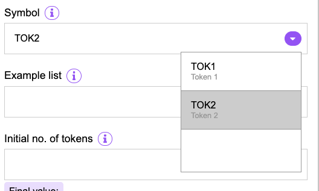

Inputs define the input fields that show in a panel.

Inputs have types, optional validation checks and ultimately feed into contract method arguments. By default
inputs are rendered in the order in which they're defined in a panel.

## Structure

```js
{
  ...,
  "panels": [
    {
      ...,
      "inputs": [
        {
          "name": "...",
          "title": "...",
          "initialValue": "...",
          "options": "...",
          "type": "...",
          "placeholder": "...",
          "helpText": "...",
          "unit": "...",
          "scale": "...",
          "validation": [ ... ]
        },
        ...
      ]
    }
  ]
}
```

## Reference

**name**

The name of the input. This is not shown to the user but is instead the canonical internal name of the input. It must be unique in the list of input names for its parent panel.

Example:

```js
{
  "name": "tokenName"
}
```

The above example's input value can be referenced elsewhere in the Dapp using `@input[tokenName]`.

**title**

The user-friendly name of the input. This is shown the user as the label for the input.

Example:

```js
{
  "title": "Token name"
}
```

**type**

The input type. At present this must be one of:

* `address`
* `bool`
* `bytes32`
* `int`
* `string`
* `int[]`
* `bytes32[]`
* `address[]`

Example:

```js
{
  "type": "bytes32"
}
```

The types suffixed with `[]` are [list input types](../ListInputs) and specify lists of values.


**placeholder** _(optional)_

The placholder text.

Example:

```js
{
  "placeholder": "A non-zero number"
}
```


**helpText** _(optional)_

Help text to be displayed next to the input field to help clarify its use.

Example:

```js
{
  "helpText": "Please enter the desired totaly supply of your token."
}
```


**initialValue** _(optional)_

Initial value to display in the input field, specified as one of.

  * A named [constant](../Constants).
  * An [environment variable](../EnvVars).
  * A fixed string value.

Example using a fixed value:

```js
{
  "initialValue": "100"
}
```

Example using a named constant:

```js
{
  "initialValue": "@constant[contractAddress]"
}
```

Example using an environment variable:

```js
{
  "initialValue": "@env[account]"
}
```

**options** _(optional)_

Display a dropdown of values for the user to select from, though they can still edit the input field
manually.



Options are specifed as one of:

  * A named [constant](../Constants).
  * An array of labels and values.

Example using an array of labels and values:

```js
{
  "options": [
    {
      "label": "Token 1",
      "value": "TOK1"
    },
    {
      "label": "Token 2",
      "value": "TOK2"
    }
  ]
}
```

Example using a constant:

```js
{
  "constants": {
    "tokenNames": {
      "default": [
        {
          "label": "Token 1",
          "value": "TOK1"
        },
        {
          "label": "Token 2",
          "value": "TOK2"
        }
      ]
    }
  },
  "panels": [
    ...,
    {
      ...,
      "inputs": [
        ...,
        {
          ...,
          "options": "@constant[tokenNames]"
        }
      ]
    }
  ]
}
```

**unit** _(optional)_

Applies to `type`: `int`

This is user-friendly text that gets shown in the tooltip
popup next to the input label:


Example:

```js
{
  "unit": "TOKEN"
}
```

**scale** _(optional)_

Applies to `type`: `int`

This is how to much to scale the input value by to obtain the real integer value. This
means multiplying the input value by `10^scale` to obtain the real value.

For example, if inputting an ETH value then the scale should be set to 18 to
ensure that the real value sent to the contract is measured in WEI.

Example:

```js
{
  "scale": 18
}
```

**validation** _(optional)_

List of [validation checks](../InputValidation) for this input field.

Example:

```js
{
  "validation": [
    {
      ...
      "type": "..."
    },
    ...
  ]
}
```

